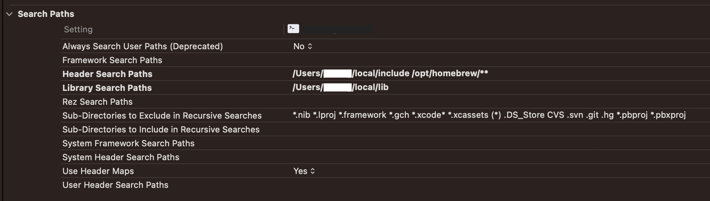

#### CONTENTS
- [QuantLib on a Mac](#quantlib-on-a-mac)

<hr>

# QuantLib on a Mac
Installing and using `QuantLib` on a mac is timeless entertainment. Although I've done it several times in the past, both on mac os x and on windows machines, it always takes me a few hours of googling and troubleshooting, and it always leaves me with the same feeling that it was all avoidable frustration since the online instructions are clear. I don't know why this is the case, since I have a natural proclivity for attention to detail, but always something falls between the cracks while following said instructions. So I decided to document the process for my own benefit in a way that highlights the little things that derail the process and which, in hindsight, are obvious. Hopefully, someone else will also find these notes useful.

- Get the library

  QuantLib can be downloaded from here: [QuantLib](https://github.com/lballabio/QuantLib/releases)

  On a mac, you'd want the `tar` file.

- Follow the installation instructions: [Installation](https://www.quantlib.org/install/macosx.shtml)

  - **Boost:** The first step in the installation guide pertains to the `boost` C++ library (libraries?) which is a dependency of QuantLib's. Using `Homebrew` to install `boost` works perfectly fine (for my purposes, at least &mdash; I haven't had to look back).

  - **Compile from source:** For QuantLib itself, however, I want the source code and the ability to modify it so I go directly to the `configure` step of the guide. Since I'm on `Ventura 13.6.9` (TMI, I know) the command

  ```zsh
  ./configure --with-boost-include=/opt/homebrew/include/ \
            --prefix=${HOME}/local/ \
            CXXFLAGS='-O2 -stdlib=libc++ -mmacosx-version-min=10.9' \
            LDFLAGS='-stdlib=libc++ -mmacosx-version-min=10.9'
  ```
  
  runs successfully but installation will fail. The snippet that works is

  ```zsh
  ./configure --with-boost-include=/opt/homebrew/include/ \
            --prefix=${HOME}/local/ \
            CXXFLAGS='-O2 -stdlib=libc++ -mmacosx-version-min=13.6.9' \
            LDFLAGS='-stdlib=libc++ -mmacosx-version-min=13.6.9'
  ```

  Finding the difference is left as an exercise for the reader (*hint: mac os x min version*)

  - **make:** `make` and `make install` should now work

  - **Xcode:** At this point boost and QuantLib have been installed, and the next challenge to tackle is the use of QuantLib in an XCode project.

    - Naturally, you open Xcode, create a new project, and set the `header` and `lib` paths.

      

      (the redacted part in each path is my username on my machine)

    - Error #1 &mdash; Incompatibility between `boost` and `QuantLib` or the dreaded `No member named 'X' in namespace 'std'`
      
      As promised at the beginning, this is meant to be **fun**; therefore, compiling a hello-world program **of course** will not work off the bat. Attempting to compile a toy project leads to dozens of errors about members missing from the `std` namespace show up. Or, expressed in beatiful prose, something along the lines of
      
      ```
      /Applications/Xcode.app/Contents/Developer/Platforms/MacOSX.platform/Developer/SDKs/MacOSX14.0.sdk/usr/include/c++/v1/__string/char_traits.h:286:17: No member named '__constexpr_wmemcmp' in namespace 'std'
      ```

      It turns out that the errors can be addressed by updating the boost library. So this is not an issue with Xcode; rather, boost and QuantLib have to be "compatibly compiled" (can't use different C++ dialects, for example). In short,

      ```zsh
      brew install boost
      ```

      fixes the issue (without having to recompile QuantLib, assuming the update to boost brings boost up to date with QuantLib).

    - Error #2 &mdash; Undefined symbols

      Remember, this is all avoidable frustration. There is no one to blame but ourselves. I'm far from an Xcode expert, but my understanding here is that setting a `lib` path in the project's build settings, does not mean that the linker will link all libraries in every lib path listed (that would be kind of outrageous behaviour, to be fair). The path just tells the linker where to look should a library be needed. Undefined-symbol errors scream linking issues and, indeed, adding a linker flag fixes the problem.

      In Xcode, 
        - show the `Project Navigator` (panel on the left-hand side),
        - select the project (top node of the navigation tree),
        - choose the `Build Settings` tab in the main area,
        - go to the `Linking - General` section,
        - and set the value of the field `Other Linker Flags` to `-lQuantLib`.

  
Everything should work now. To test, you can instantiate a `Date` object from QuantLib

```c++
#include <iostream>
#include <ql/quantlib.hpp>

namespace QL = QuantLib;

int main(int argc, const char * argv[]) {
    QL::Date bday {31, QL::December, 1939};
    std::cout << "My birthday is on " << bday << '\n';
    return 0;
}
```

compile and run.
